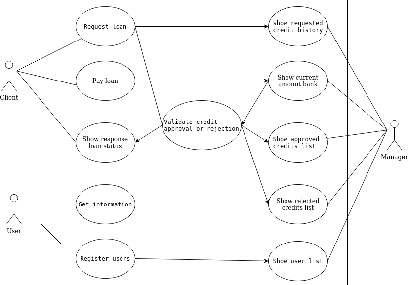
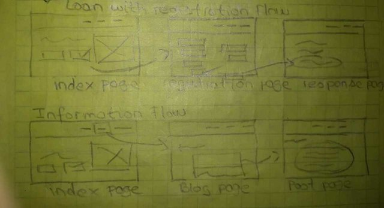
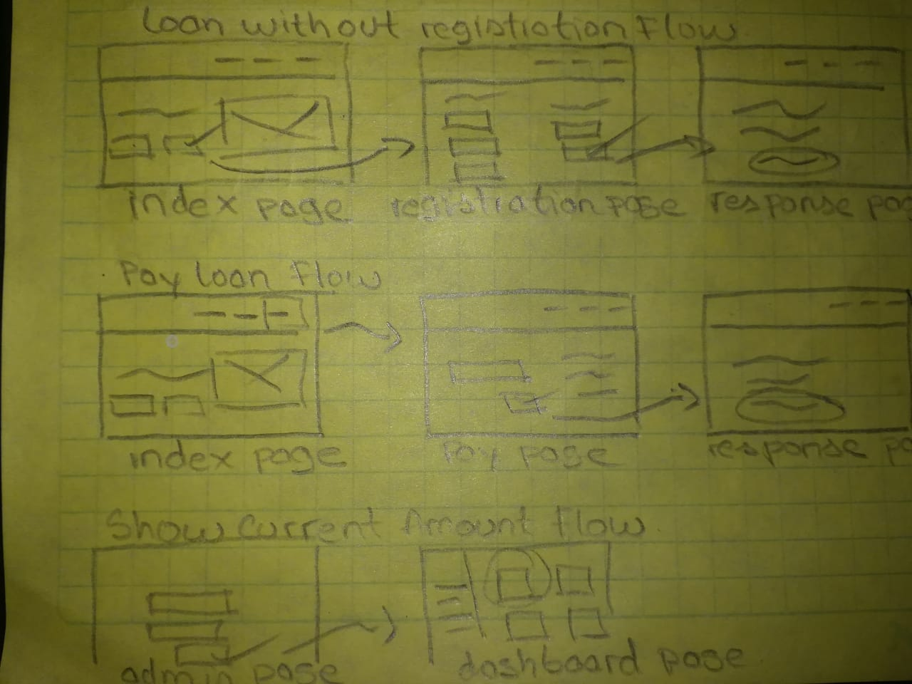
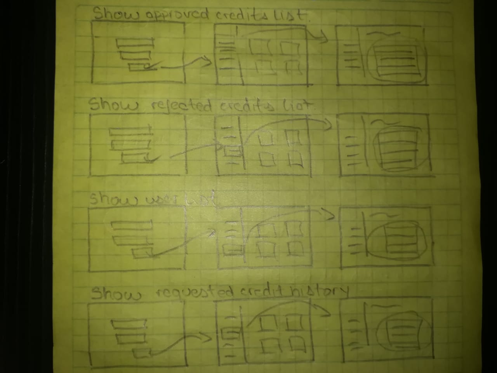

# UBank

A new Personal Microcredit Platform

## Reason why

Productivity depends, among many other variables, on the initial capital investment. On the other hand, in South America it's difficult to obtain financing to develop a project. Therefore, to improve the region's productivity, new sources of financing must be found for providing opportunities

### Intention

UBanco was born as a proposal to facilitate financing. We believe in the region's individual capacity to innovate and grow in a more connected and interdependent world.

## Brand Development

### Philosophy

- **Help:** Social cooperation is essential.
- **Love:** Desire and do good to all people, without any particular interest.
- **Peace:** Avoid conflicts, discussions and misunderstandings.

### The identifier

Bank is a polysemic word that can mean: Long and narrow seat for several people or Public credit establishment. Based on this idea, an approach to both parties is sought, linking the principle love of your philosophy. Love is related to the heart's icon, so a bank with that profile can be an interesting proposal.

## Requirements

- Create a loan component that allows the user to choose the amount for request
  between a minimum value and a maximum value (eg vlr. min. 10,000 - vlr. max. 100,000).

- Create a component that is always visible with the bank's base amount and it must
  change according to the loans and payments that are made. Example (base amount:
  $ 1,000,000 and the bank makes a loan for $ 100,000, the new bank's amount should show up as \$ 900,000)

- The system must create users with the following parameters:
  -- Name
  -- Mail
  -- Identification card
  -- You must use the loan component to select the value of the credit, which includes:
  --- Requested Value
  --- Pay date (optional)

- At the time of making the request, the system must randomly validate if the credit was approved or not.

- The system should display a list of requests that are approved and pending payment. (must show amount, name, and payment button). In the same way, it must allow to pay the approved credits.

- Create a key in the project environment variables where the bank's base capital is specified.

### The Uses Cases

Based on the requirement, the following use cases were prepared

### The Web Flow

The screens with their interactions are summarized in the following images

### Wireframes

These are some wireframes with the interactions on the screens
